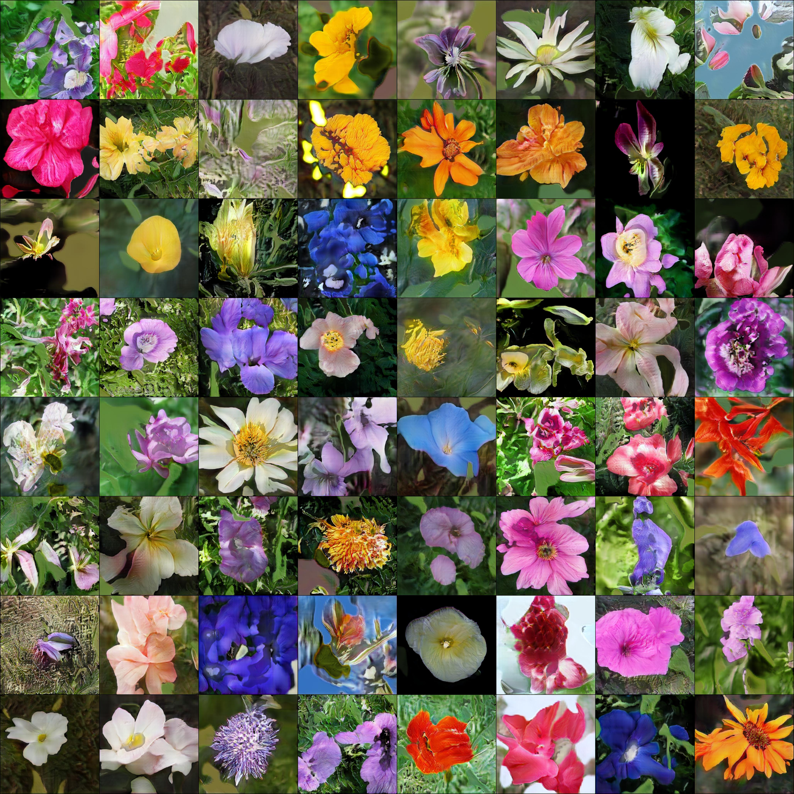</img>

*512x512 flowers after 12 hours of training, 1 gpu*

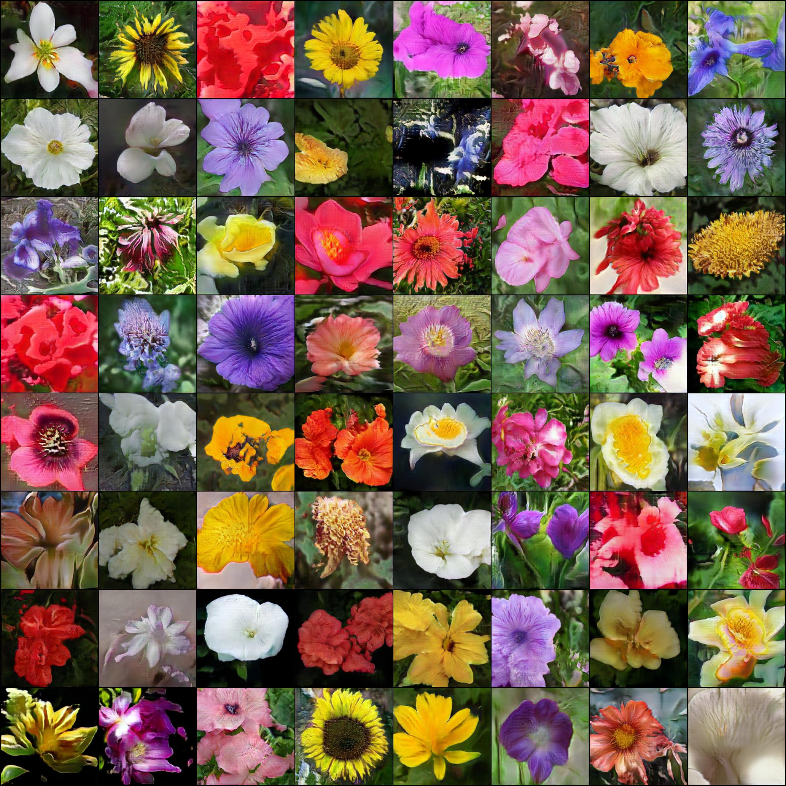</img>

*256x256 flowers after 12 hours of training, 1 gpu*

</img>

*Pizza*

## 'Lightweight' GAN

[](https://badge.fury.io/py/lightweight-gan)

Implementation of <a href="https://openreview.net/forum?id=1Fqg133qRaI">'lightweight' GAN</a> proposed in ICLR 2021, in Pytorch. The main contributions of the paper is a skip-layer excitation in the generator, paired with autoencoding self-supervised learning in the discriminator. Quoting the one-line summary "converge on single gpu with few hours' training, on 1024 resolution sub-hundred images".

## Install

```bash
$ pip install lightweight-gan
```

## Use

One command

```bash
$ lightweight_gan --data ./path/to/images --image-size 512
```

Model will be saved to `./models/{name}` every 1000 iterations, and samples from the model saved to `./results/{name}`. `name` will be `default`, by default.

## Training settings

Pretty self explanatory for deep learning practitioners

```bash
$ lightweight_gan \
    --data ./path/to/images \
    --name {name of run} \
    --batch-size 16 \
    --gradient-accumulate-every 4 \
    --num-train-steps 200000
```

## Augmentation

Augmentation is essential for Lightweight GAN to work effectively in a low data setting

By default, the augmentation types is set to translation and cutout, with color omitted. You can include color as well with the following.

```bash
$ lightweight_gan --data ./path/to/images --aug-prob 0.25 --aug-types [translation,cutout,color]
```

### Test augmentation

You can test and see how your images will be augmented before it pass into a neural network (if you use augmentation). Let's see how it works on this image:

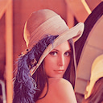

#### Basic usage

Base code to augment your image, define `--aug-test` and put path to your image into `--data`:

```bash
lightweight_gan \
    --aug-test \
    --data ./path/to/lena.jpg
```

After this will be created the file lena_augs.jpg that will be look something like this:

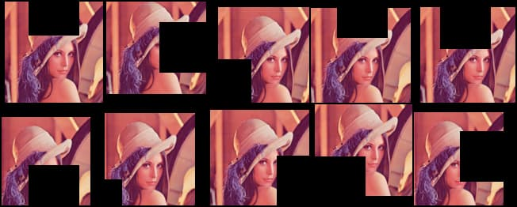


#### Options

You can use some options to change result:
- `--image-size 256` to change size of image tiles in the result. Default: `256`.
- `--aug-type [color,cutout,translation]` to combine several augmentations. Default: `[cutout,translation]`.
- `--batch-size 10` to change count of images in the result image. Default: `10`.
- `--num-image-tiles 5` to change count of tiles in the result image. Default: `5`.

Try this command:
```bash
lightweight_gan \
    --aug-test \
    --data ./path/to/lena.jpg \
    --batch-size 16 \
    --num-image-tiles 4 \
    --aug-types [color,translation]
```

result wil be something like that:

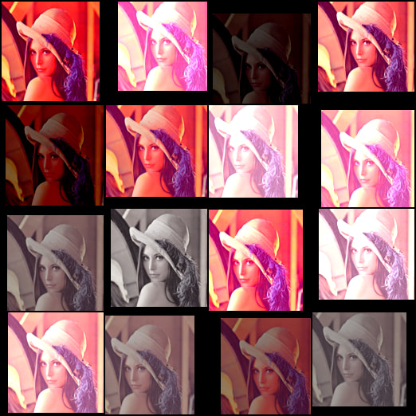

### Types of augmentations

This library contains several types of embedded augmentations.  
Some of these works by default, some of these can be controlled from  a command as options in the `--aug-types`:
- Horizontal flip (work by default, not under control, runs in the AugWrapper class);
- `color` randomly change brightness, saturation and contrast;
- `cutout` creates random black boxes on the image; 
- `offset` randomly moves image by x and y-axis with repeating image;
  - `offset_h` only by an x-axis;
  - `offset_v` only by a y-axis;
- `translation` randomly moves image on the canvas with black background;

Full setup of augmentations is `--aug-types [color,cutout,offset,translation]`.  
General recommendation is using suitable augs for your data and as many as possible, then after sometime of training disable most destructive (for image) augs.

#### Color

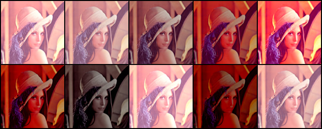

#### Cutout

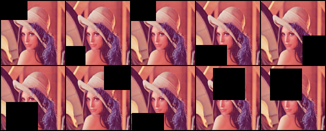

#### Offset

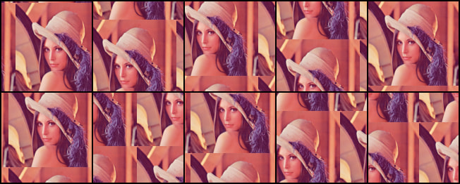

Only x-axis:

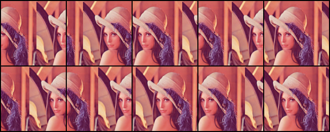

Only y-axis:

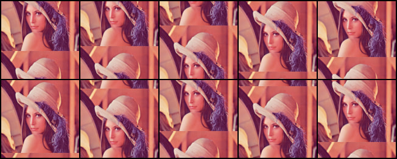

#### Translation


## Mixed precision

You can turn on automatic mixed precision with one flag `--amp`

You should expect it to be 33% faster and save up to 40% memory

## Multiple GPUs

Also one flag to use `--multi-gpus`


## Visualizing training insights with Aim

[Aim](https://github.com/aimhubio/aim) is an open-source experiment tracker that logs your training runs, enables a beautiful UI to compare them and an API to query them programmatically.

First you need to install `aim` with `pip`

```bash
$ pip install aim
```

Next, you can specify Aim logs directory with `--aim_repo` flag, otherwise logs will be stored in the current directory

```bash
$ lightweight_gan --data ./path/to/images --image-size 512 --use-aim --aim_repo ./path/to/logs/
```

Execute `aim up --repo ./path/to/logs/` to run Aim UI on your server.

**View all tracked runs, each metric last tracked values and tracked hyperparameters in Runs Dashboard:**


**Compare loss curves with Metrics Explorer - group and aggregate by any hyperparameter to easily compare the runs:**


**Compare and debug generated images across training steps and runs via Images Explorer:**


## Generating

Once you have finished training, you can generate samples with one command. You can select which checkpoint number to load from. If `--load-from` is not specified, will default to the latest.

```bash
$ lightweight_gan \
  --name {name of run} \
  --load-from {checkpoint num} \
  --generate \
  --generate-types {types of result, default: [default,ema]} \
  --num-image-tiles {count of image result}
```

After run this command you will get folder near results image folder with postfix "-generated-{checkpoint num}".

You can also generate interpolations

```bash
$ lightweight_gan --name {name of run} --generate-interpolation
```

## Show progress

After creating several checkpoints of model you can generate progress as sequence images by command:

```bash
$ lightweight_gan \
  --name {name of run} \
  --show-progress \
  --generate-types {types of result, default: [default,ema]} \
  --num-image-tiles {count of image result}
```

After running this command you will get a new folder in the results folder, with postfix "-progress". You can convert the images to a video with ffmpeg using the command "ffmpeg -framerate 10 -pattern_type glob -i '*-ema.jpg' out.mp4".

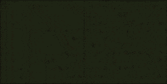


## Discriminator output size

The author has kindly let me know that the discriminator output size (5x5 vs 1x1) leads to different results on different datasets. (5x5 works better for art than for faces, as an example). You can toggle this with a single flag

```bash
# disc output size is by default 1x1
$ lightweight_gan --data ./path/to/art --image-size 512 --disc-output-size 5
```

## Attention

You can add linear + axial attention to specific resolution layers with the following

```bash
# make sure there are no spaces between the values within the brackets []
$ lightweight_gan --data ./path/to/images --image-size 512 --attn-res-layers [32,64] --aug-prob 0.25
```

## Dual Contrastive Loss

A recent paper has proposed that a novel contrastive loss between the real and fake logits can improve quality slightly over the default hinge loss.

You can use this with one extra flag as follows

```bash
$ lightweight_gan --data ./path/to/images --dual-contrast-loss
```

## Bonus

You can also train with transparent images

```bash
$ lightweight_gan --data ./path/to/images --transparent
```

Or greyscale

```bash
$ lightweight_gan --data ./path/to/images --greyscale
```

## Alternatives

If you want the current state of the art GAN, you can find it at https://github.com/lucidrains/stylegan2-pytorch

## Citations

```bibtex
@inproceedings{
    anonymous2021towards,
    title   = {Towards Faster and Stabilized {\{}GAN{\}} Training for High-fidelity Few-shot Image Synthesis},
    author  = {Anonymous},
    booktitle = {Submitted to International Conference on Learning Representations},
    year    = {2021},
    url     = {https://openreview.net/forum?id=1Fqg133qRaI},
    note    = {under review}
}
```

```bibtex
@misc{cao2020global,
    title   = {Global Context Networks},
    author  = {Yue Cao and Jiarui Xu and Stephen Lin and Fangyun Wei and Han Hu},
    year    = {2020},
    eprint  = {2012.13375},
    archivePrefix = {arXiv},
    primaryClass = {cs.CV}
}
```

```bibtex
@misc{qin2020fcanet,
    title   = {FcaNet: Frequency Channel Attention Networks},
    author  = {Zequn Qin and Pengyi Zhang and Fei Wu and Xi Li},
    year    = {2020},
    eprint  = {2012.11879},
    archivePrefix = {arXiv},
    primaryClass = {cs.CV}
}
```

```bibtex
@misc{yu2021dual,
    title   = {Dual Contrastive Loss and Attention for GANs}, 
    author  = {Ning Yu and Guilin Liu and Aysegul Dundar and Andrew Tao and Bryan Catanzaro and Larry Davis and Mario Fritz},
    year    = {2021},
    eprint  = {2103.16748},
    archivePrefix = {arXiv},
    primaryClass = {cs.CV}
}
```

```bibtex
@article{Sunkara2022NoMS,
    title   = {No More Strided Convolutions or Pooling: A New CNN Building Block for Low-Resolution Images and Small Objects},
    author  = {Raja Sunkara and Tie Luo},
    journal = {ArXiv},
    year    = {2022},
    volume  = {abs/2208.03641}
}
```

*What I cannot create, I do not understand* - Richard Feynman
